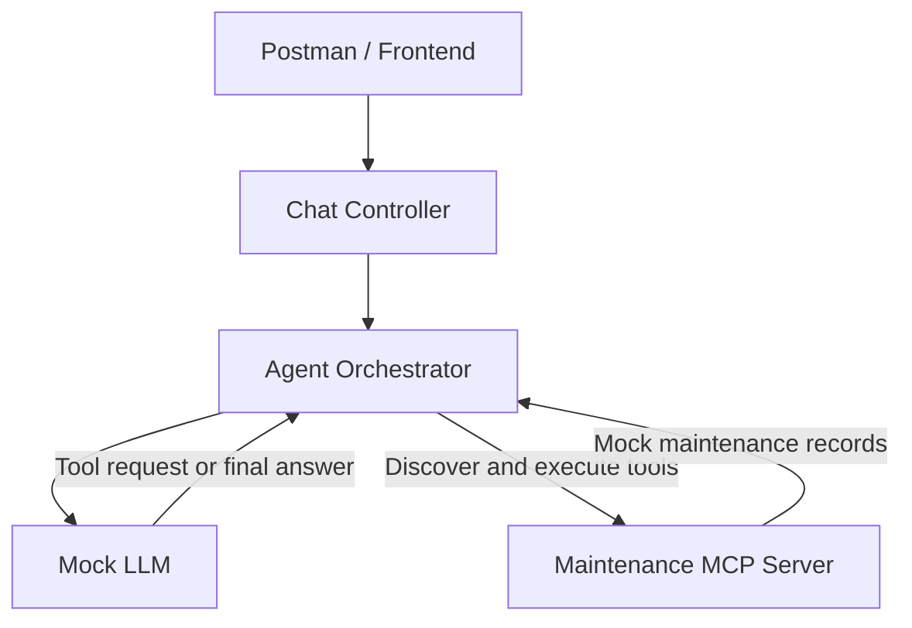

# Internal Operations Agent

A small chatbot API for practicing AI agent architecture and MCP integrations. I just threw this together in a single afternoon to familiarize myself with the general architecture patterns at work here.

The HTTP API, agent loop, and MCP communication work. LLM decisions and maintenance data are mocked.

## Architecture



The orchestrator returns the final answer through the controller to the client.

## Each Layer's Purpose

| File | Responsibility |
|---|---|
| `main.py` | Create the application and register routers |
| `schemas/chat.py` | Define and validate request/response models |
| `controllers/chat_controller.py` | Handle HTTP requests and call the agent |
| `agent.py` | Manage the conversation, validate tool requests, and execute them |
| `llm_client.py` | Mock choosing a tool and summarizing its result |
| `mcp_servers/maintenance_server.py` | Expose the maintenance lookup through MCP |
| `services/` | Placeholder for future internal API integrations |

**The LLM proposes a tool call. The orchestrator validates and executes it. MCP provides the interface for discovering and calling the tool.**

## Example Request Flow

1. User asks: “Show maintenance history for EQ-1001.”
2. Controller passes the message to the orchestrator.
3. Orchestrator discovers MCP tools and sends their definitions to the mock LLM.
4. Mock LLM requests `get_maintenance_history` with the equipment ID.
5. Orchestrator checks the allowlist, validates arguments, and executes the tool.
6. Tool returns mock records.
7. Orchestrator passes the result back to the mock LLM for a final summary.

## Run and Test

With Docker Desktop running:

```bash
docker compose up --build
```

Send a request from Postman:

```http
POST http://localhost:8000/api/agent/chat
Content-Type: application/json
```

```json
{
  "message": "Show maintenance history for EQ-1001"
}
```

Interactive API docs: http://localhost:8000/docs

## Current Scope

- One container; MCP uses an in-memory connection within the API process.
- New conversation for each HTTP request.
- One allowed read-only tool, argument validation, tool timeout, and bounded agent loop.
- Hardcoded maintenance data; no external LLM, database, or authentication.

Next: add service adapters, equipment lookup, and a separate MCP server over HTTP.