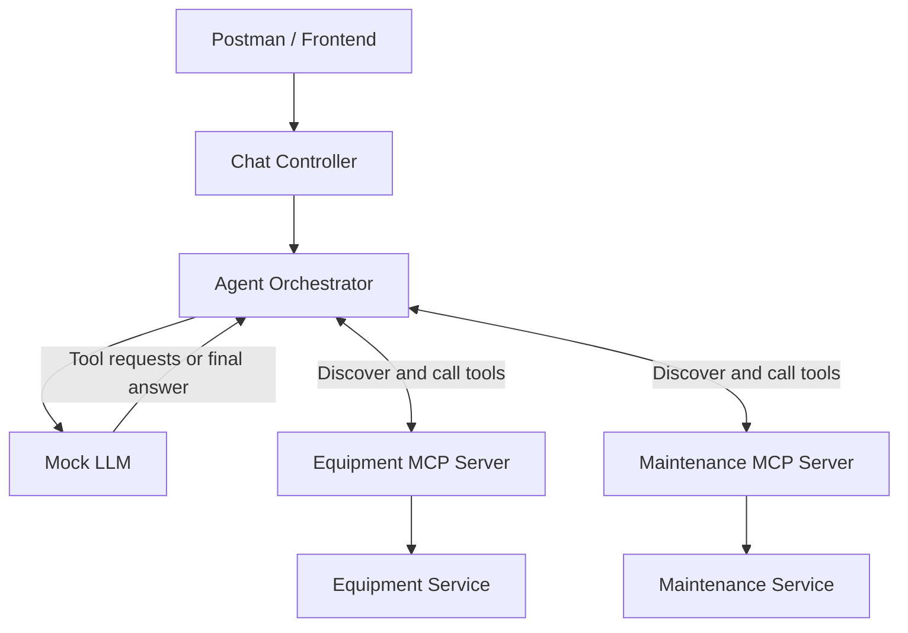

# Internal Operations Agent

A small chatbot API for practicing AI agent architecture and MCP integrations. I just threw this together in a single afternoon to familiarize myself with the general architecture patterns at work here.

The HTTP API, agent loop, and MCP communication work. LLM decisions use scripted keyword rules, and the service layer returns mock equipment and maintenance data.

## Architecture



Both MCP servers run inside the API process using in-memory connections. Their tools call service functions and return the resulting data to the agent.

## Each Layer's Purpose

| File | Responsibility |
|---|---|
| `main.py` | Create the application and register routers |
| `schemas/chat.py` | Define request and response models |
| `controllers/chat_controller.py` | Handle HTTP requests and call the agent |
| `agent.py` | Discover tools, validate requests, route calls, and manage the conversation |
| `llm_client.py` | Simulate tool selection and combine results into an answer |
| `mcp_servers/equipment_server.py` | Expose equipment lookup through MCP |
| `mcp_servers/maintenance_server.py` | Expose maintenance lookup through MCP |
| `services/equipment.py` | Retrieve mock equipment details |
| `services/maintenance.py` | Retrieve mock maintenance records |

**The LLM proposes tool calls. The agent validates and executes them. MCP exposes the tools, and the services retrieve the data.**

## Example Request Flow

1. User asks for an overview of EQ-1001.
2. Controller passes the message to the agent.
3. Agent discovers permitted tools from both MCP servers.
4. Mock LLM requests equipment details and maintenance history.
5. Agent validates arguments and routes each call to the correct server.
6. MCP tools call their services and return mock data.
7. Agent adds the results to the conversation.
8. Mock LLM combines the results into a final answer.

## Run and Test

With Docker Desktop running:

```bash
docker compose up --build
```

Send requests using Postman: Body → raw → JSON.

```http
POST http://localhost:8000/api/agent/chat
Content-Type: application/json
```

Equipment lookup:

```json
{
  "message": "Show equipment details for EQ-1001"
}
```

Maintenance lookup:

```json
{
  "message": "Show maintenance history for EQ-1001"
}
```

Both lookups:

```json
{
  "message": "What can you tell me about EQ-1001, and does it have any urgent maintenance issues?"
}
```

Mock data is available for `EQ-1001` and `EQ-1002`.

Interactive API docs: http://localhost:8000/docs

## Current Scope

- One container with two MCP servers connected in memory.
- A fresh conversation for each HTTP request.
- Two permitted read-only tools.
- JSON schema validation and a 10-second timeout per tool call.
- A maximum of five LLM turns per request.
- Tool calls execute sequentially.
- Scripted LLM behavior and hardcoded service data.
- No external LLM, database, or authentication.

## Next Steps

- Replace the mock LLM with a real model.
- Connect service functions to internal APIs or a database.
- Move MCP servers into separate processes using HTTP transport.